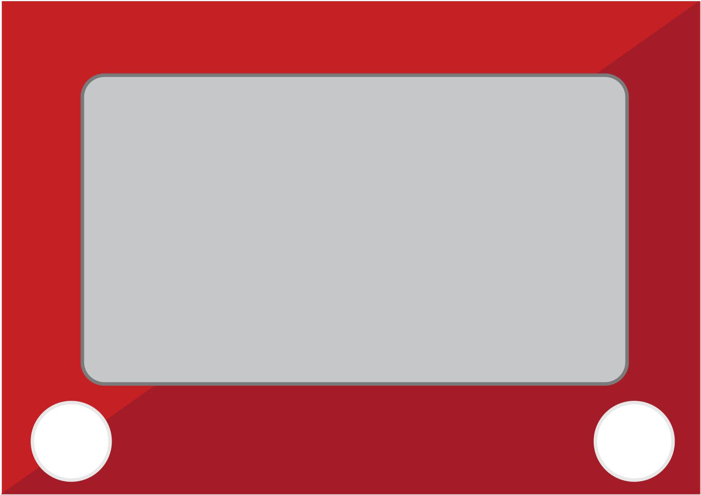
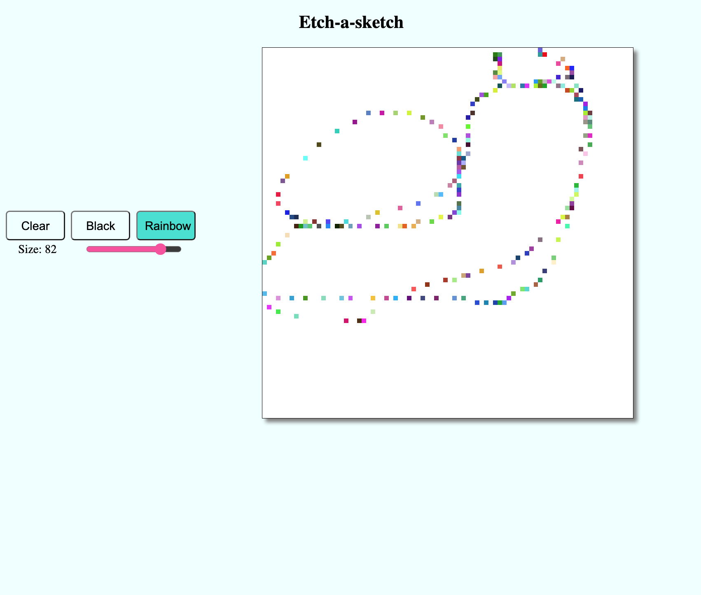

    

<h2 align="center">Etch-a-sketch</h2>

  

  Draw your heart out
  

   
  <a href="https://errantpianist.github.io/odin-etch-a-sketch/">View Demo</a>
  

 

## Preview

 

### Built With

- 
- 
- 

## Features

- A simple etch-a-sketch implemented using pure HTML/CSS/JS
- Clickless drawing with your mouse

 

## Outcome

- Used CSS3 **grid** to populate sketch area with boxes
- Used minimally sized functions to separate logic

 

## What I learned

- Use of onhover effects
- Use of range input to make a slider

 

## Reflections

A quick implementation of an etch-a-sketch.

Some features that could be added:

- Add color picker
- Allow color picking without redrawing the grid

 

## Acknowledgments

- Thanks to [The Odin Project](https://www.theodinproject.com/) for putting together such an extensive open-source curriculum!
   

<!-- CONTACT -->

## Author

